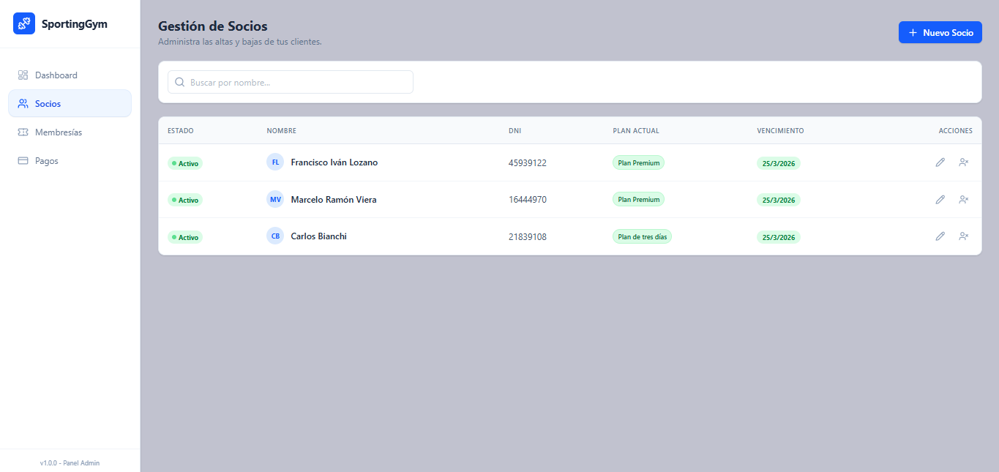
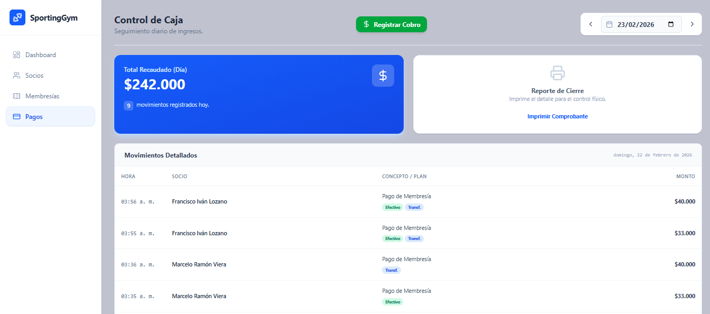

# 🏋️‍♂️ SportingGym - Sistema de Gestión de Gimnasios


**SportingGym** es una aplicación web integral diseñada para modernizar la administración de gimnasios locales. Permite gestionar socios, controlar vencimientos de cuotas, administrar planes de membresía y llevar un control estricto de la caja diaria, reemplazando las planillas de cálculo manuales por un sistema automatizado y eficiente.

---

## 📸 Capturas de Pantalla

| Dashboard Principal | Gestión de Socios |
|:-------------------:|:-----------------:|
|  |  |
| *Vista general de KPIs y alertas* | *Listado con estados y fechas de vencimiento* |
| **Gestión de Membresías** | **Control de Pagos y Caja** |
|  |  |
| *Configuración de planes y tarifas dinámicas* | *Registro de ingresos y reporte de cierre listo para imprimir* |

---

## 🚀 Funcionalidades Principales

### 📊 Panel de Control (Dashboard)
- **KPIs en tiempo real:** Visualización instantánea de socios activos, ingresos del mes y cuotas al día.
- **Alertas de Vencimiento:** Notificación visual de membresías próximas a vencer y lista de deudores.
- **Accesos directos:** Botones rápidos para las operaciones más frecuentes.

### 👥 Gestión de Socios
- **CRUD Completo:** Alta, baja (lógica/soft delete) y modificación de datos personales.
- **Estado de Actividad:** Indicadores de vencimiento en tiempo real y bloqueo de acceso a deudores.
- **Asignación de Planes:** Vinculación automática de membresía al momento del alta.

### 💳 Control de Caja y Pagos
- **Registro de Cobros:** Flujo transaccional que registra el ingreso de dinero y renueva la membresía del socio automáticamente.
- **Cierre de Caja Diario:** Filtro por fecha para validar la recaudación del día contra el efectivo físico.
- **Comprobantes Profesionales:** Generación de un reporte de cierre de caja optimizado para impresión térmica o A4.

### 🏷️ Gestión de Tarifas
- **Planes Personalizables:** Creación y edición de tipos de membresía (Ej: Pase Libre, 3 días x semana).
- **Control de Precios:** Actualización de costos de forma sencilla y directa.

---

## 🛠️ Stack Tecnológico

### Backend (API)
- **Framework:** .NET 8 (C#)
- **ORM:** Entity Framework Core (Code First con Auto-Migración)
- **Base de Datos:** PostgreSQL
- **Arquitectura:** Patrón Controlador-Servicio-Repositorio

### Frontend (Cliente)
- **Framework:** React + Vite
- **Estilos:** Tailwind CSS
- **Iconos:** Lucide React
- **Notificaciones:** React Hot Toast
- **HTTP Client:** Axios

---

## 💻 Instalación y Ejecución

### Opción 1: Despliegue rápido con Docker 🐳 (Recomendado)
La forma más sencilla de probar el proyecto. No necesitas instalar bases de datos, ni .NET, ni Node.js. El sistema crea las tablas automáticamente al iniciar.

**Prerrequisitos:** [Docker Desktop](https://www.docker.com/products/docker-desktop/)

1. Clona el repositorio y entra a la carpeta:
   ```bash
   git clone [https://github.com/tu-usuario/SportingGym.git](https://github.com/tu-usuario/SportingGym.git)
   cd SportingGym
2. Ejecutar el contenedor:
   docker compose up --build
3. Abre tu navegador:
   Frontend (App): http://localhost:5173
   Backend (API): http://localhost:8080/api/socios
### Opción 2: Desarrollo Local Manual (Sin Docker)
Si deseas modificar el código y correr los servicios por separado.
Prerrequisitos: .NET 8 SDK, Node.js & npm, PostgreSQL.
1. Configuración del Backend
   1. Clona el repositorio.
   2. Navega a la carpeta del Backend y configura tu cadena de conexión en appsettings.json.
   3. Ejecuta las migraciones para crear la base de datos:
      dotnet ef database update
   4. Corre la Api:
      dotnet run
2. Configuración del Frontend
   1. Navega a la carpeta del Frontend (cd sportinggym-frontend).
   2. Instala las dependencias:
        npm install
   3. Inicia el servidor de desarrollo:
        npm run dev
