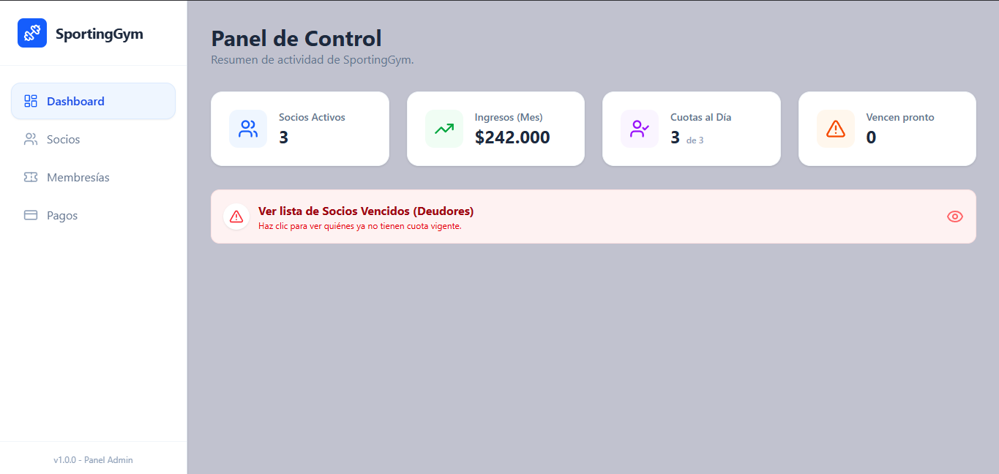

# 🏋️‍♂️ SportingGym - Sistema de Gestión de Gimnasios


**SportingGym** es una aplicación web integral diseñada para modernizar la administración de gimnasios locales. Permite gestionar socios, controlar vencimientos de cuotas, administrar planes de membresía y llevar un control estricto de la caja diaria, reemplazando las planillas de cálculo manuales por un sistema automatizado y eficiente.

---

## 📸 Capturas de Pantalla

| Dashboard Principal | Gestión de Socios |
|:-------------------:|:-----------------:|
|  |  |
| *Vista general de KPIs y alertas* | *Listado con estados y acciones rápidas* |

---

## 🚀 Funcionalidades Principales

### 📊 Panel de Control (Dashboard)
- **KPIs en tiempo real:** Visualización instantánea de socios activos, ingresos del mes y cuotas al día.
- **Alertas de Vencimiento:** Notificación visual de membresías próximas a vencer y lista de deudores.
- **Accesos directos:** Botones rápidos para las operaciones más frecuentes.

### 👥 Gestión de Socios
- **CRUD Completo:** Alta, baja (lógica/soft delete) y modificación de datos personales.
- **Estado de Actividad:** Interruptor rápido para activar/desactivar el acceso de un socio.
- **Asignación de Planes:** Vinculación automática de membresía al momento del alta.

### 💳 Control de Caja y Pagos
- **Registro de Cobros:** Flujo transaccional que registra el ingreso de dinero y renueva la membresía del socio automáticamente.
- **Cierre de Caja Diario:** Filtro por fecha para validar la recaudación del día contra el efectivo físico.
- **Histórico de Movimientos:** Auditoría completa de todos los ingresos.

### 🏷️ Gestión de Tarifas
- **Planes Personalizables:** Creación y edición de tipos de membresía (Ej: Pase Libre, 3 días x semana).
- **Control de Precios:** Actualización de costos sin necesidad de tocar la base de datos.

---

## 🛠️ Stack Tecnológico

### Backend (API)
- **Framework:** .NET 8 (C#)
- **ORM:** Entity Framework Core (Code First)
- **Base de Datos:** PostgreSQL
- **Arquitectura:** Patrón Controlador-Servicio-Repositorio.

### Frontend (Cliente)
- **Framework:** React + Vite
- **Estilos:** Tailwind CSS
- **Iconos:** Lucide React
- **Notificaciones:** SweetAlert2 & React Hot Toast
- **HTTP Client:** Axios

---

## 💻 Instalación y Configuración

Sigue estos pasos para correr el proyecto localmente.

### Prerrequisitos
- .NET 8 SDK
- Node.js & npm
- PostgreSQL instalado y corriendo.

### 1. Configuración del Backend

   1. Clona el repositorio:
      ```bash
      git clone [https://github.com/tu-usuario/SportingGym.git](https://github.com/tu-usuario/SportingGym.git)
   2. Navega a la carpeta del Backend y configura tu cadena de conexión en appsettings.json:
      "ConnectionStrings": {
        "DefaultConnection": "Host=localhost;Port=5432;Database=SportingGymDb;Username=tu_usuario;Password=tu_password"
      }
   3. Ejecuta las migraciones para crear la base de datos:
      dotnet ef database update
   4. Corre la API:
      dotnet run
### 2. Configuración del Frontend
   1. Navega a la carpeta del Frontend:
      cd sporting-gym-frontend
   2. Instala las dependencias:
      npm install
   3. Crea un archivo .env si es necesario para apuntar a tu API (por defecto localhost:puerto).
   4. Inicia el servidor de desarrollo:
      npm run dev
